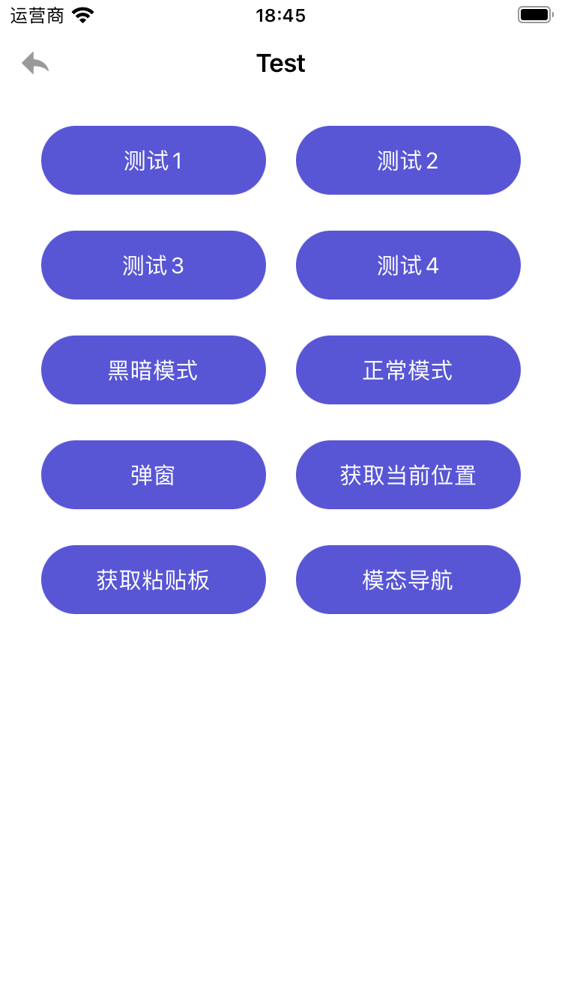
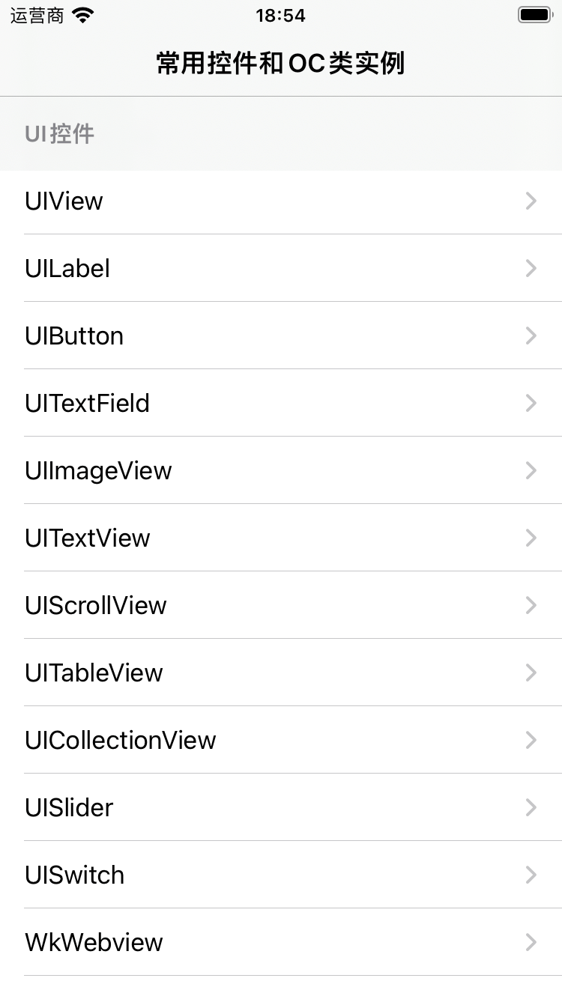
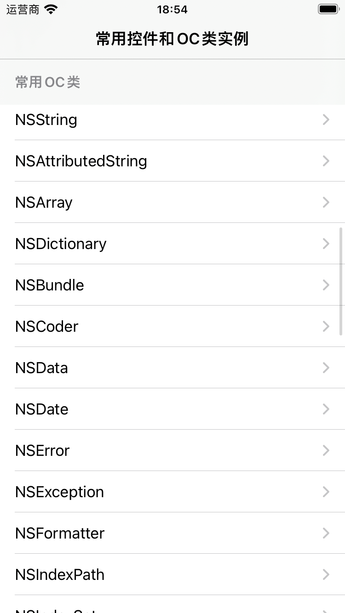
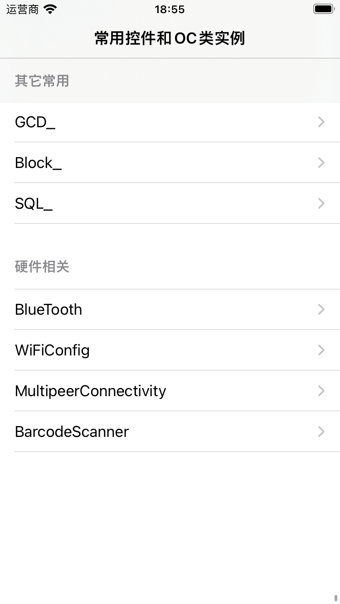
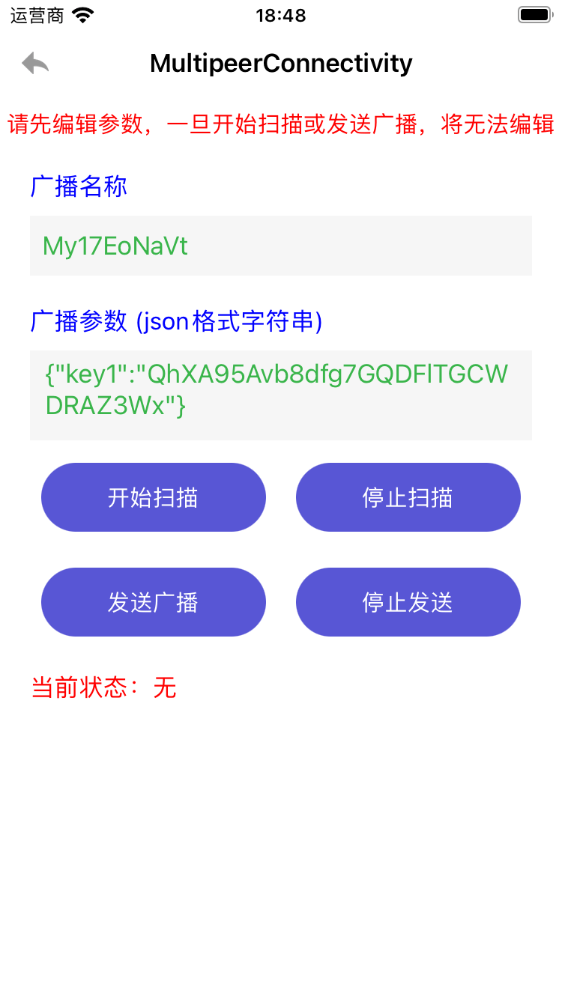

## PublicMethods
- PublicWay：公共方法（定位获取/相册权限判断/RuntimeAPI）
- MBProgressHUD：进度指示器
- NetWorkRequest：网络请求/Websocket
- ImagePreview：图片浏览器(防微信)
- MyDefinitionWay：封装各类常用方法

## ProjectCode
- UI_Sample：包含各种常用的UI组件及示例

  
  
  

- NS_Sample：包含各种常见的OC类示例及用法

- Hardware：wifi/蓝牙/扫码/近场通讯等硬件能力

  
  
  
  

- Other_Sample：多线程/Block/数据库等

  
  
  

